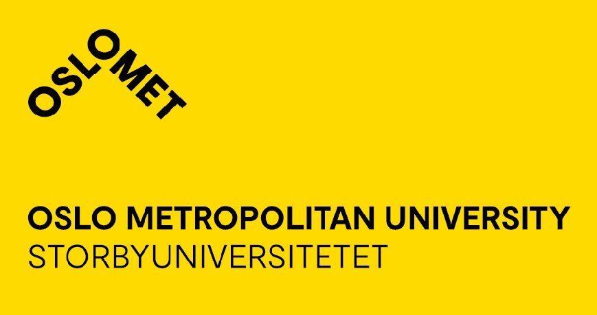
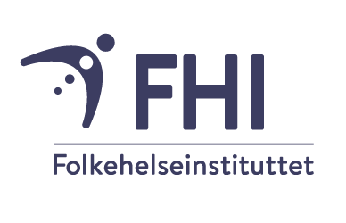

```{r, include=FALSE}
knitr::opts_chunk$set(eval = FALSE)
```

<br>


<br>

## Siste nytt {.unnumbered}

<br>

<p style="font-family: times, serif; font-size:16pt; font-style:italic">

🎉 **Temakveld 28.05.2026**

</p>

</b>

"*Topic to be announced*" with [Anna Chaimani]{style="color:red"}

<u>Program</u>:

17.00 - 17.30: Pizza, sushi and beverages

17.30 - 18.30: Presentation by Anna Chaimani

**Place**: Department of Biostatistics (UiO), ([Auditorium 13, Domus Medica, Gaustad, Sognsvannsveien 9, 
0372 Oslo](https://use.mazemap.com/?campusid=799&sharepoitype=identifier&sharepoi=GA01-2015&config=uio))

**Speaker**: Anna Chaimani, UiO

**Title**: [ TBA ]{style="color:red"}

**Abstract**:

TBA. </b>

<br>


📰 **Ny utgave av** [***Tilfeldig gang***]{style="color:red"}

</p>

En ny utgave av TG ([nr. 2 årgang 42](https://drive.google.com/file/d/1AkF1gs-_x_kYRKhUOtgYxjEomtfYAQoO/view))
ligger nå ute på nettsidene!

<br>


## Lokale institusjoner {.unnumbered}

<br>

{width="30%"}
{width="20%"}
{width="20%"}
{width="20%"}

{width="10%"}
{width="20%"}
{width="25%"} </b>

<br>

## Kontakt

<br>

[Kontakt oss](mailto:zhi.zhao@medisin.uio.no)
